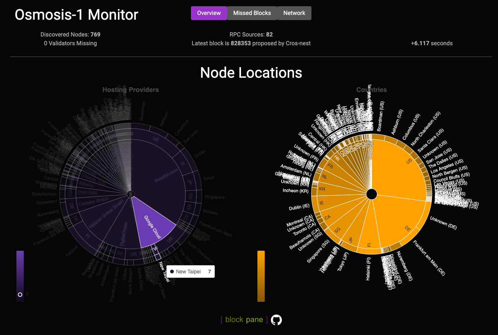
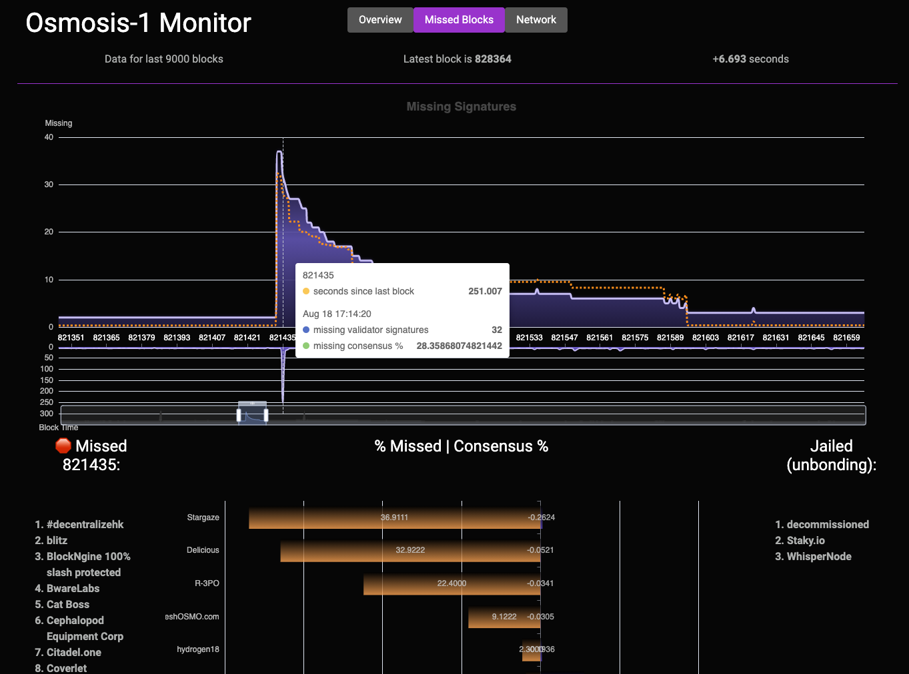
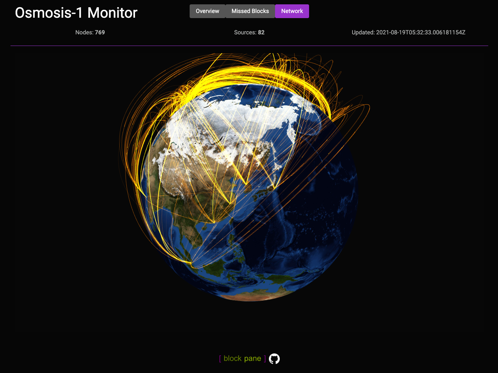

# cosmissed

Simple webservice/dashboard for tracking network info and missed blocks on Tendermint/Cosmos chains.

_Unfortunately running this service requires a commercial subscription to Maxmind's API service. I would have liked to just use their free databases, but hosting it publicly violates their license terms._

Summary page:



Missed block monitor:



Network Graph:



* The reports sent lag by 2 blocks and will not be sent if the server is syncing, this is to avoid false positives which
  can occur if the server is slow or behind (this affects the tendermint prometheus exporter too.
* This requires access to both the tendermint and cosmos rpc APIs (normally port 26657 and 1317, or can use unix domain sockets.) 
* It may be traffic intensive (especially when building the cache,) and should be run against a local, private server.
* The error `not a valid HistValidatorsResp structure` at startup likely means that the state has been pruned for that block height
  on your API server and there is not enough history to build the full cache. Try a lower `-n` value (normally the upper limit is 9,000).
* All assets are bundled using [go:embed](https://pkg.go.dev/embed), so a simple `go install github.com/blockpane/cosmissed` should get everything needed to run.

Usage:

```
Usage of cosmissedd
  -c string
        cosmos http API endpoint (default "http://127.0.0.1:1317")
  -cache string
        filename for caching previous blocks (default "cosmissed.dat")
  -extra-rpc string
        extra tendermint RPC endpoints to poll for peer info, comma seperated list of URLs
  -key string
        Required: Key for GeoIP2 Precision Web Service
  -l int
        webserver port to listen on (default 8080)
  -n int
        most recent blocks to track (default 3000)
  -p string
        address prefix, ex- cosmos = cosmosvaloper, cosmosvalcons ... (default "cosmos")
  -socket string
        filename for unix socket to listen on, if set will disable TCP listener
  -t string
        tendermint http API endpoint (default "http://127.0.0.1:26657")
  -user string
        Required: Username for GeoIP2 Precision Web Service
  -v    log new records to stdout (error logs already on stderr)
```

This project uses [eCharts](https://echarts.apache.org/en/index.html) for the visualizations and [Bootswatch](https://bootswatch.com/) for themes.
