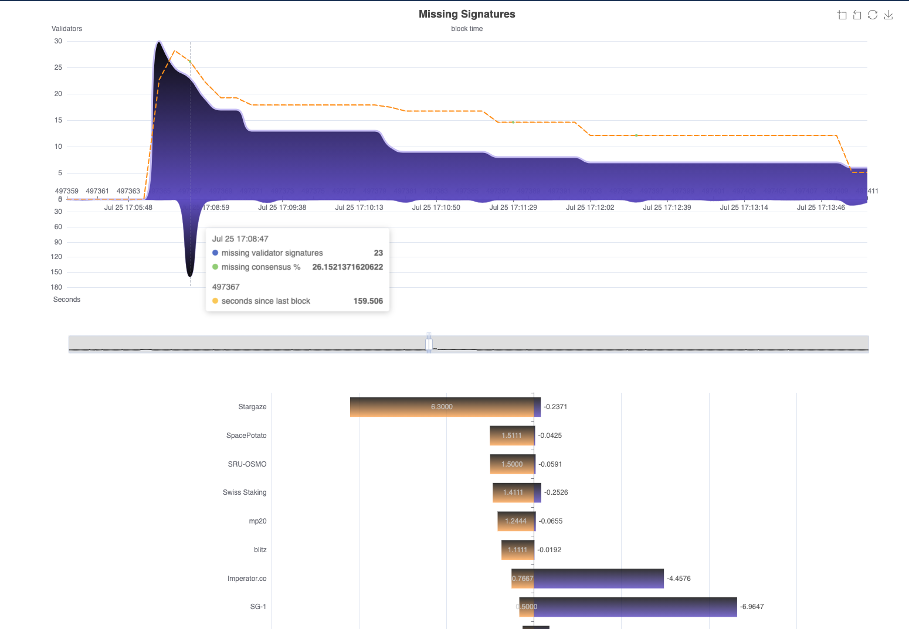

# cosmissed

Simple webservice/dashboard for tracking missed blocks on Tendermint/Cosmos chains.



Provides two endpoints:

* `/missed` - sends an array of records for last number of tracked `-n` blocks (default 3000)
* `/chart` - same as previous data, but broken into multiple arrays easier for some charting libraries to consume.
* `/top` - data for top missing validators, times missed, percent, and vote data
* `/params` - general data about the chain, very sparse for now.

There are also a few websockets in the works, but documenting them is delayed until the frontend is consuming that information.

A record looks like this:

```json
{
  "block_num": 123456,
  "timestamp": 1627000000,
  "missed": 2,
  "missing": {
    "some missing validator": "cosmosvalconsxxxxxxxxxxxxxxxxxxxxxxxxxxxxxxxxxxxxxxx",
    "some other failed validator": "cosmosvalconszzzzzzzzzzzzzzzzzzzzzzzzzzzzzzzzzzzzzzz"
  },
  "proposer": "the proposing validator"
}
```

* The reports sent lag by 3 blocks and will not be sent if the server is syncing, this is to avoid false positives which
  can occur if the server is slow or behind (this affects the tendermint prometheus exporter too.
* This requires access to both the tendermint and cosmos rpc APIs (normally port 26657 and 1317.) 
* It may be traffic intensive (especially when building the cache,) and should be run against a local, private server.
* The error `not a valid HistValidatorsResp structure` at startup likely means that the state has been pruned for that block height
  on your API server and there is not enough history to build the full cache. Try a lower `-n` value.

Usage:

```
Usage of cosmissedd
  -c string
    	cosmos http API endpoint (default "http://127.0.0.1:1317")
  -l int
    	webserver port to listen on (default 8080)
  -n int
    	most recent blocks to track (default 3000)
  -p string
    	address prefix, ex- cosmos = cosmosvaloper, cosmosvalcons ... (default "cosmos")
  -t string
    	tendermint http API endpoint (default "http://127.0.0.1:26657")
  -v	log new records to stdout (error logs already on stderr)
```

